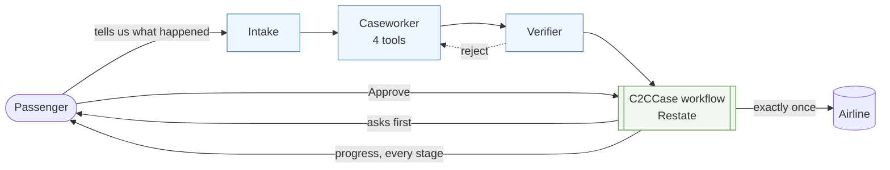

# C2C — Cancellation to Compensation

**A durable agent that stays with an airline disruption claim until the claim is
actually resolved.**

> The hard part of agentic AI isn't making an agent reason once.
> It's making it reliably stay with a real-world problem until the problem is
> actually resolved.

Everything here is synthetic. No real airline is contacted, no real claim is
submitted, and every legal-looking artifact is stamped
**SYNTHETIC DEMO — NOT FOR SUBMISSION — NOT LEGAL ADVICE**.

---

## Who has this problem

A passenger whose flight was cancelled or badly delayed, who is probably owed
money, and who has a job. Not a lawyer. Someone with a booking reference, a
blurry photo of a departures board, and about forty minutes of patience.

Secondarily, the small claims operations and passenger-rights non-profits who do
this at volume and currently solve it by paying a person to read the same six
documents over and over.

## The bottleneck is the calendar, not the decision

Working out whether a claim is worth anything takes a competent person about
fifteen minutes. Everything after that is where claims die:

| Step | Elapsed | What the passenger must do |
|---|---|---|
| Assess | 15 min | read a policy they have never seen |
| Submit | 20 min | assemble evidence |
| **Wait** | **4–8 weeks** | remember that they are waiting |
| Read the rejection | 10 min | notice it contradicts the airline's own record |
| Challenge | 30 min | know that challenging is even an option |
| **Wait again** | **4 weeks** | remember, again |
| Escalate | 45 min | know the escalation is ripe, and not before |

The work is small. The calendar is enormous. Between the first click and the
money there are two or three multi-week silences, and each one is a place where
a valid claim quietly dies — not because it was wrong, but because nobody was
still holding it.

That is the **persistence gap**: whether you get what the policy says you are
owed depends less on the merits than on whether you have the knowledge, the
time, and the stubbornness to keep coming back for three months.

Full write-up: [`docs/PROBLEM.md`](docs/PROBLEM.md). Why I care:
[`docs/PERSONAL_MOTIVATION.md`](docs/PERSONAL_MOTIVATION.md).

---

## Architecture

**Agents reason. Workflows remember.** Every boundary follows from that.



Blue forgets everything the moment it returns. Green survives `kill -9`. That
split is the entire design, and it is why NanoClaw was rejected — its persistent
sessions would have competed with the workflow for owning the case.

[`docs/ARCHITECTURE.md`](docs/ARCHITECTURE.md) has the full diagrams: the state
machine a case moves through, and a sequence diagram of what a crash mid-claim
actually costs.

### What is agentic about it

- **Tools, not an oracle.** The caseworker retrieves documents, looks up policy
  clauses and computes. **No tool returns a verdict** — a `check_eligibility()`
  backed by a rules engine would have turned the benchmark into a test of
  whether the agent can call one function.
- **Independent verification.** The verifier gets the case and the policy but
  **not** the caseworker's working, so it is a second opinion rather than a
  reviewer inheriting a wrong turn. It can reject, and a rejection sends the
  case back for one revision. A rejection citing no clause or document is
  downgraded to a pass, because an uncited rejection can talk a correct
  caseworker out of a correct answer.
- **Durable memory outside the agent.** The agent is stateless. The case lives
  in Restate, where it survives `kill -9`, waits days for a human, and cannot
  execute a consequential action twice.
- **Human approval that is enforced, not requested.** Every consequential action
  blocks on a durable promise, and the rejection branch returns before any
  outbound call is reachable.

---

## Results

Two suites, because a system can be good at one and bad at the other, and a
passenger needs both.

### Suite A — reasoning · 28 synthetic cases

Primary metric **Case Resolution Accuracy**: a case counts only when the next
action, the compensation figure, **and** the other entitlements (duty of care,
downgrade) are all correct at once. Same model, same policy, same dossier, same
schema for every system.

<!--RESULTS_TABLE-->
| System | CRA | Action | Compensation | Entitlements (DoC) | Unsupported claims | False escalations | Model calls | Cost |
|---|---|---|---|---|---|---|---|---|
| Baseline — one direct prompt, no tools, no verifier | **0.82** | 0.86 | 1.00 | 0.96 | 0 | 0 | 28 | $1.37 |
| **Full agent** — tools, loop, independent verifier | **0.93** | 0.93 | 1.00 | 1.00 | 0 | 0 | 102 | $3.77 |
| **Change, baseline → full agent** | **+0.11** | | | | | | | |

Both runs use the same model (`claude-haiku-4-5-20251001`), the same policy, the same 28 cases, the same output schema and the same grader, against the same first-party endpoint. The best possible constant answer on this suite is **0.25**.

**Read +0.11 as directional, not significant.** It is three cases, and this project has no valid variance estimate — the one it had was withdrawn in FAILURES.md F-008 once it turned out to be measuring dropped cases rather than sampling. The agent's figure is also merged from two partial runs covering the benchmark exactly once (`c2c/eval/merge.py`, which refuses to merge across different endpoints, incomplete coverage, or a case counted twice); the baseline is a single clean run.
<!--/RESULTS_TABLE-->

### Suite B — durability · 6 failure-injection scenarios

| Metric | Result |
|---|---|
| Scenarios passed | **6 / 6** (and 6/6 again inside Docker) |
| Workflow completion | 1.00 |
| Failure recovery | 1.00 |
| State preserved after `kill -9` | 1.00 |
| **Duplicate consequential actions** | **0** |

The load-bearing one is **D06**: SIGKILL the worker inside the submission
window. The carrier received **2 submission attempts** and **1 claim landed** —
the crash genuinely did cause a retry, and the idempotency key, generated inside
a durable step and therefore stable across replay, absorbed it. And **D05**:
when a human refuses, the carrier is called **zero** times, not once and then
reversed.

**The baseline scores nothing here, and that is not reported as a win.** It is a
single prompt with no lifecycle; there is nothing for a crash to interrupt.
Suite B measures whether Restate delivers the invariants it was added for.

Raw results: [`evaluation/results/`](evaluation/results/) — never overwritten,
each carrying its commit, model, backend and prompt digests.

---

## The biggest improvement, and an honest note about it

**On the reasoning axis, the independent verifier.** On the durability axis, and
more importantly, deciding where case memory lives.

The verifier is what the numbers show. Adding tools and a multi-step loop was
supposed to be the big lever and largely was not — the agent made **1.4 tool
calls per case** and called `calculate` **three times in 28 cases**. What changed
the score was a second model, given the same case and the policy but *not* the
caseworker's working, told to reach its own conclusion first and then compare.

The clearest single piece of evidence is **R16** — a partial settlement where the
carrier paid duty of care and refused compensation on a weather ground its own
operations log contradicts. It failed under the baseline. It failed under
tools-only. It passes under the verifier. Duty-of-care accuracy went 0.96 → 1.00
and evidence sufficiency 0.89 → 0.93, which is exactly the shape of "someone
checked the arithmetic and re-read the clause".

It is not free: **3.6× the model calls and 2.8× the cost** for +0.11.

But the improvement that actually mattered was not a component at all. It was
answering *where does the case remember itself?* — and being strict about it. The
answer is the durable workflow, not the agent runtime and not the control plane.
That single decision is why NanoClaw was rejected (`experiments/EXP-004`), why
there is no database, why FastAPI holds no case state, and why a `kill -9` in the
window around a claim submission produces **two attempts at the carrier and one
landed claim** instead of two claims.

The reasoning improvement is three cases. The durability property is the
difference between a system that helps and a system that submits your claim
twice.

---

## Reproducing this

**With Docker, and nothing else:**

```bash
git clone https://github.com/yablokolabs/c2c-agent.git && cd c2c-agent
cp .env.example .env          # add an ANTHROPIC_API_KEY
docker compose up --build -d  # own Restate, control plane, durable workflow
curl localhost:8199/c2c/health
```

**Or locally:**

```bash
make setup
make configure   # optional — writes .env and checks it actually works
make test        # 165 tests, no model calls, no services
make reproduce   # baseline + agent + comparison
```

Needs Python 3.11+, [uv](https://docs.astral.sh/uv/), and either an
`ANTHROPIC_API_KEY` or a logged-in Claude Code CLI. **No Restate server, no
Docker and no Telegram** for the headline result.

For the durability half: `make up && make failure-tests && make down`.

Full guide with versions, expected output, runtime and measured cost:
[`docs/REPRODUCTION.md`](docs/REPRODUCTION.md).

---

## Trajectories

`trajectories/runs/<run-id>/events.jsonl` is canonical; `trajectory.md` is the
same thing rendered for a human. Every run of every agent is captured: the
instructions, each tool call and what came back, the stated rationale, the
verifier's decision, retries, workflow transitions, human approvals, and the
outcome.

No hidden reasoning is captured — only material a reviewer can audit.

```bash
make trajectories
```

---

## The simulation boundary

| Simulated | Real |
|---|---|
| the carrier and its claims system | the model |
| every passenger, booking and document | the durable workflow engine and its crash semantics |
| the compensation policy (SHCP v1.1) | the injected failures |
| the Synthetic Passenger Rights Body | the audit log the results are measured from |

The policy's thresholds deliberately match no real scheme — not only for the
ground rules, but because a model that could recall the real regulation would
never have to read the document in front of it. Every correct answer here has to
be grounded in the supplied text.

---

## The main failure mode

The agent asserts money it never computed.

It has a `calculate` tool. Across 28 cases it called it **three times**, and made
**1.4 tool calls per case** overall. Eleven cases used no tool at all and
answered in a single step — structurally identical to the baseline it was
supposed to improve on.

The two cases it still gets wrong, R16 and R25, both fail on duty-of-care
arithmetic: a partial settlement, and a receipts total with a non-reimbursable
line and a cap. `calculate` was available on both and called on neither. The
prompt already told it to use the tool "for every arithmetic step, including sums
of receipts and each multiplication," in bold, with an example.

It read the instruction and did the sums in its head anyway, because it is
capable of doing them in its head and confident about it. Nothing in the loop
noticed that a figure had been asserted rather than derived.

That is the failure mode worth naming, because it is invisible in an aggregate
score and it is the one that reaches the passenger. A wrong number in a claim
letter is not a system that failed loudly — it is a system that produced a
confident, well-cited, correctly-formatted document with the wrong amount in it.

The corrective experiment is EXP-005: a verdict asserting money it never computed
is handed back once, with the arithmetic it owes. Enforcement in the loop rather
than instruction in the prompt.

---

## Hot take

**When a control moves and you did not touch the control, stop theorising about
the treatment.**

Three separate times, this project reported infrastructure as capability.

A required schema field turned one well-formed verdict into a zero (F-001). Six
cases were never sent to the model and were scored as six wrong answers, which
stood as the headline comparison for two days (F-008). A gateway served a
different model entirely while every result file still recorded
`claude-haiku-4-5-20251001`, because that field logged what was *requested*
(F-007).

Every one of those looked exactly like a reasoning result. 0.68 is a completely
plausible score for a single-prompt baseline. Nothing about it invites suspicion.

What caught all three was the same thing: **the baseline moved when nothing about
the baseline had changed.** 0.68, then 0.75, then 0.29, then 0.82 — same prompt,
same policy, same cases, every time. That is not a model being variable. That is
an instrument being broken, and it was legible in data I had already printed —
`model_calls: 23` on a 28-case run sat in every result file from the first
evaluation onward, unread.

The practical version, for anyone building an eval harness:

- **A missing answer is not a wrong answer.** If your grader cannot tell them
  apart, it will quietly report your infrastructure as your agent's reasoning.
- **The model field is not provenance. The endpoint is.** Anything between you
  and the provider can serve something else and still let every log line name
  the model you asked for.
- **Re-run your control, not just your treatment.** A baseline you measured once
  and then stopped questioning is an assumption wearing a number's clothes.

And the thing I actually got wrong at the start: I assumed the reasoning would be
the hard part and the durability would be plumbing. A single prompt already
handles most of these cases. What a single prompt cannot do is still be holding
the case in week six — which is the part that decides whether a passenger gets
paid.

---

## Where everything is

| | |
|---|---|
| Problem and user | [`docs/PROBLEM.md`](docs/PROBLEM.md) |
| Architecture, stack, decisions | [`docs/ARCHITECTURE.md`](docs/ARCHITECTURE.md) · [`docs/STACK.md`](docs/STACK.md) · [`docs/DECISIONS.md`](docs/DECISIONS.md) |
| **Improvement changelog** | [`IMPROVEMENT_CHANGELOG.md`](IMPROVEMENT_CHANGELOG.md) |
| Experiments, including removed ones | [`experiments/`](experiments/) |
| **Failure journal** | [`FAILURES.md`](FAILURES.md) |
| Metrics and their weaknesses | [`docs/EVALUATION.md`](docs/EVALUATION.md) · [`docs/LIMITATIONS.md`](docs/LIMITATIONS.md) |
| Reproduction | [`docs/REPRODUCTION.md`](docs/REPRODUCTION.md) |
| Demo script | [`docs/DEMO_SCRIPT.md`](docs/DEMO_SCRIPT.md) |
| Agent instructions | [`agents/caseworker/SYSTEM_PROMPT.md`](agents/caseworker/SYSTEM_PROMPT.md) · [`agents/verifier/SYSTEM_PROMPT.md`](agents/verifier/SYSTEM_PROMPT.md) |
| The synthetic policy | [`benchmark/POLICY.md`](benchmark/POLICY.md) |
| Hackathon requirement mapping | [`docs/HACKATHON_REQUIREMENTS.md`](docs/HACKATHON_REQUIREMENTS.md) |
| What existed before the competition | [`docs/ENVIRONMENT.md`](docs/ENVIRONMENT.md) |
