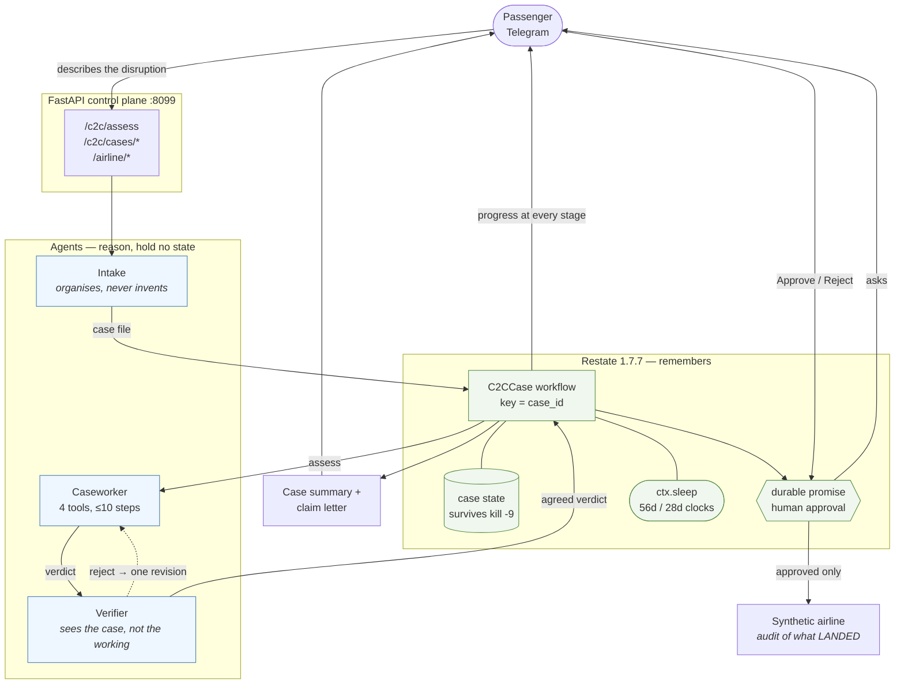
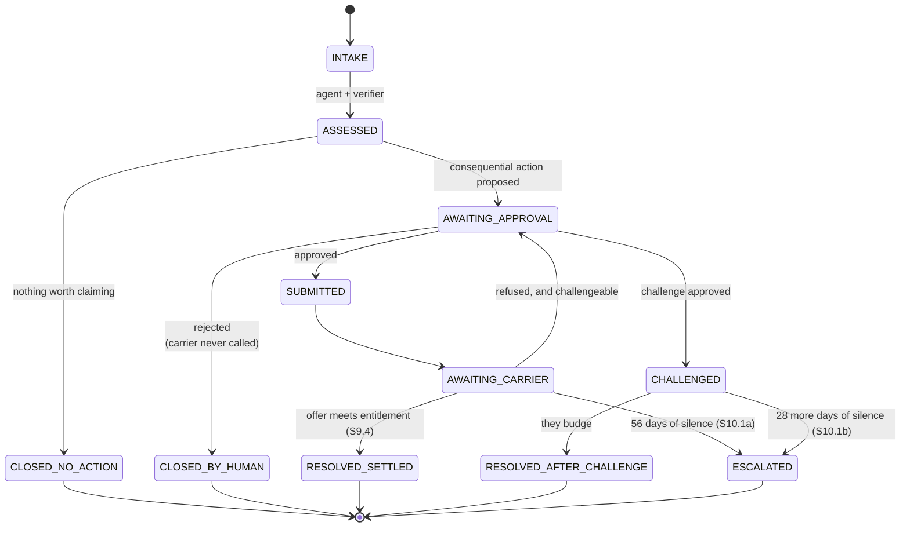
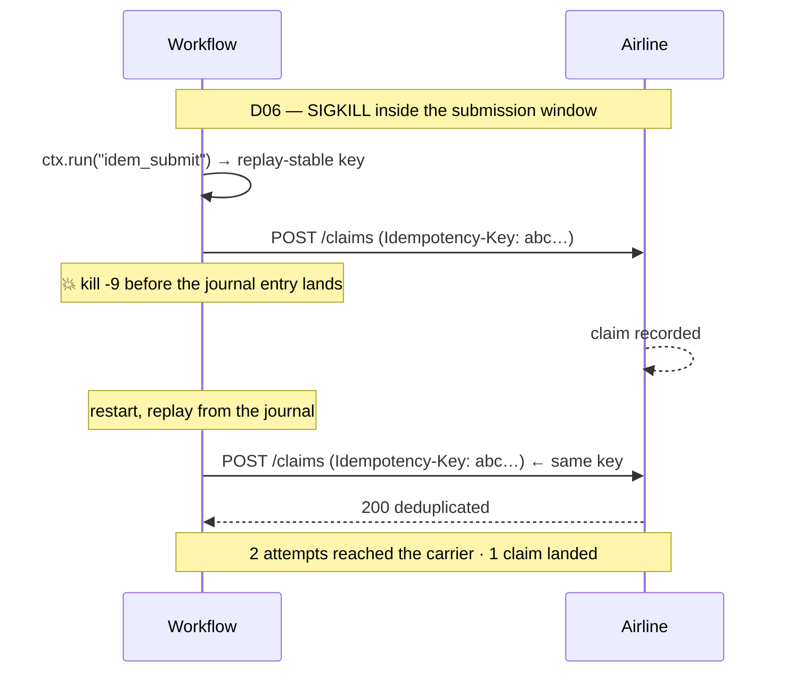

# Architecture

## The organising principle

**Agents reason. Workflows remember.**

Every boundary in this system follows from that one sentence, and the places it
was tempting to violate it are the places it earns its keep.

| Component | Owns | Explicitly does not own |
|---|---|---|
| Claude | the reasoning | any state |
| Caseworker / Verifier | one case's assessment, right now | what happened last week |
| FastAPI | HTTP, and being the surface humans and the workflow talk to | case state, decisions |
| Restate | case state, timers, approval waits, exactly-once execution | any judgement about a claim |
| Artifact renderer | turning a verdict into documents a person can send | deciding any number in them |
| Airline simulator | the external world, and the audit of what it received | anything C2C asserts about itself |

The temptation this resists is putting case state in the control plane, because
that is where the HTTP handlers already are. Then a FastAPI restart loses a case
and a retry submits a claim twice. Restate exists precisely so neither is
possible, and giving it that job is the whole reason it is here.

---

## The picture



**Read the two boxes as the whole argument.** Everything in the blue box is
stateless and forgets immediately. Everything in the green box survives a
`kill -9`. A rejected approval never reaches the airline, because the branch
returns before any call is reachable — measured by D05, where the carrier
endpoint is called zero times.

## The lifecycle a case moves through



Every transition out of `AWAITING_APPROVAL` requires a human. Every clock is a
durable timer, not a poll — the workflow consumes nothing while waiting, and the
wait survives a restart.

## What a crash actually costs



Measured, not asserted: the airline's audit log distinguishes attempts from
landings. Had it shown one attempt, the kill would have missed its window and
the scenario would have proved nothing.

## Modules

| Module | Lines | Responsibility |
|---|---|---|
| `c2c/models.py` | 115 | one verdict schema shared by baseline, agent, verifier and grader |
| `c2c/llm.py` | 357 | model transport, two backends, pacing, **endpoint provenance** |
| `c2c/prompts.py` | 52 | prompt loading with content digests |
| `c2c/baseline.py` | 78 | the single-prompt system, and the caseworker-direct control |
| `c2c/agent/tools.py` | 154 | the four tools. **None of them returns a verdict.** |
| `c2c/agent/caseworker.py` | 161 | the tool loop, and optional arithmetic enforcement |
| `c2c/agent/verifier.py` | 96 | independent second opinion, can reject |
| `c2c/agent/pipeline.py` | 56 | caseworker → verifier → at most one revision |
| `c2c/artifact.py` | 176 | case summary and claim letter, deterministic |
| `c2c/workflow.py` | 253 | the durable lifecycle on Restate |
| `c2c/api.py` | 159 | control plane |
| `c2c/simulator.py` | 236 | the synthetic carrier, and the audit that measures it |
| `c2c/trajectory.py` | 187 | JSONL recorder + Markdown renderer |
| `c2c/eval/metrics.py` | 161 | metric definitions, fixed before evaluation |
| `c2c/eval/run.py` | 264 | the harness |
| `c2c/eval/durability.py` | 459 | six failure-injection scenarios |

---

## The agent

### Tools that retrieve, never decide

```
list_documents()        what is on file — and by implication, what is not
read_document(doc_id)   one document, in full
policy_lookup(query)    clause text, by id or keyword
calculate(expression)   exact arithmetic, AST-allowlisted
```

The design constraint that shaped all of them: **no tool returns a verdict.**

The tempting alternative was `check_eligibility(case)` backed by a rules engine.
That would have made the benchmark a test of whether the agent can call one
function, and would have said nothing about grounded reasoning. So the policy is
given to the model as a *document to reason over*, and the tools only fetch and
compute.

`list_documents` earns its place on absence detection specifically: several cases
turn on a document that should be in the record and is not, and a model reading a
long dossier answers from what is present.

### The verifier is independent, and constrained from being noisy

It receives the case and the policy. It does **not** receive the caseworker's
transcript — sharing it would make the verifier a reviewer of one chain of
reasoning rather than a second opinion on the case, and it would inherit any
wrong turn.

Two guards, because the hard part of a verifier is not catching errors, it is not
manufacturing them:

- a rejection citing no clause and no document is **downgraded to a pass**, since
  an uncited rejection is a preference and costs the passenger a round trip;
- an unreadable verifier **fails open**, because a verifier that cannot state a
  decision has not found anything.

Rejection sends the case back for exactly **one** revision. Two disagreements are
not convergence, they are oscillation.

### Systems under evaluation

All five run through the same harness and grader:

| System | What it is |
|---|---|
| `baseline` | one direct prompt, no tools, no verifier |
| `caseworker-direct` | the caseworker's prompt, one turn, no tools — the control that separates prompt from loop |
| `agent-tools` | caseworker + tools + loop, no verifier |
| `agent` | the above + independent verifier |
| `agent-enforced` | + a verdict asserting money it never computed is handed back once (EXP-005) |

---

## The durable layer

Each Restate feature maps to one named invariant, and each is exercised by a
scenario in the failure suite.

| Feature | Invariant | Scenario |
|---|---|---|
| workflow keyed by `case_id` | a duplicate intake cannot start a second lifecycle | D03, D04 |
| `ctx.run` | a side effect that succeeded is never re-executed on replay | D01, D06 |
| `ctx.uuid()` inside a durable step | idempotency keys are replay-stable, so a retry reuses the key | **D06** |
| `ctx.promise` | a human approval outlives the process and resolves once | D02, D03, D04 |
| the approval branch returning before any call | a rejected action is unreachable | **D05** |
| `ctx.sleep` | the 56-day and 28-day policy clocks survive restarts | **not exercised — see below** |
| `ctx.set` | case state survives `kill -9` | D02 |

### What is implemented but unverified

Two things in this layer are written and reachable, and are **not** covered by
any test or scenario. They are listed here rather than counted as working.

**`ctx.sleep` has never run.** The 56-day and 28-day policy clocks are
implemented in `_await_carrier`, and `C2C_CLOCK_SCALE` exists to compress them.
No durability scenario references the clock — the suite has zero references to
it — and no recorded trajectory contains a suspend or resume event. Restate's
timers are well-tested upstream, but *this project has not demonstrated them*.
The longest suspension actually observed is the approval wait in D02, measured in
seconds.

**The workflow emits no trajectory.** Seven event types are declared in
`c2c/trajectory.py` and never emitted anywhere: `WORKFLOW_TRANSITION`,
`WORKFLOW_SUSPEND`, `WORKFLOW_RESUME`, `HUMAN_APPROVAL_REQUIRED`,
`HUMAN_APPROVED`, `HUMAN_REJECTED` and `EXTERNAL_EVENT`. The agent records a
detailed trajectory; the durable layer records none. Workflow state lives in
Restate and is readable through `GET /c2c/cases/{id}`, and the airline's audit
log captures what actually landed — so the *evidence* exists, but it is not in
the trajectory files, and the human approval checkpoints in particular are absent
from them.

**Registered additively.** The Restate server was already running and already
hosting an unrelated project. C2C prefixes every service it owns with `C2C`,
never deletes a deployment it did not create, and `make restate-check` asserts
the other tenants are intact before and after every run.

---

## Request flow, one case end to end

1. `POST /c2c/cases/R12/open` starts the `C2CCase` workflow keyed `R12`. Opening
   it twice attaches to the same workflow rather than starting a second.
2. The workflow's `assess` step calls back to `POST /c2c/assess`, which runs the
   caseworker and the verifier. `ctx.run` means a crash here retries and a
   success here is never re-run.
3. The verdict names a consequential action, so state becomes
   `AWAITING_APPROVAL` and the workflow suspends on `ctx.promise("approval")`.
   It consumes nothing while waiting. This can last days.
4. A human answers via `POST /c2c/cases/R12/approve`, from Telegram or curl. **A
   refusal returns before any side effect is reachable** — measured by D05, where
   the carrier endpoint is called zero times.
5. On approval, `ctx.uuid()` inside a durable step produces a replay-stable
   idempotency key. A retry presents the same key and the airline deduplicates —
   measured by D06, where a crash produced 2 attempts and 1 landed claim.
6. The workflow waits on whichever comes first: the carrier's reply, or
   `ctx.sleep(56 days)`. On silence it proposes escalation, which needs its own
   approval. Every run to date has taken the reply branch; the timer branch is
   implemented and untested.
7. `GET /c2c/cases/R12/document` renders the case summary and the claim letter
   from the stored verdict.

---

## The artifact layer

A verdict is JSON. A passenger cannot send JSON to an airline.

`c2c/artifact.py` renders two documents: a plain-language summary of where the
passenger stands, and a claim or challenge letter they could put their name to,
with clauses cited and documents listed.

**Deterministic templating, no model call.** The reasoning already happened;
asking a model to also write the letter would add a place for a figure to drift
away from the one that was assessed and approved. Every artifact carries
`SYNTHETIC DEMO — NOT FOR SUBMISSION — NOT LEGAL ADVICE` and states that it must
not be sent to a real airline.

---

## Provenance, and why the endpoint is part of the architecture

Every result file records the commit, the model, the backend, the digest of the
28 case files, the digest of every prompt — and **`model_endpoint`**.

That last field is not bookkeeping. The model field records what was *requested*;
a gateway between the harness and the provider can serve something else entirely
while every log line still names the model you asked for. That happened here: the
baseline fell from 0.82 to 0.29 with no change to the baseline. See FAILURES.md
**F-007**.

So the harness warns when calls are not going to Anthropic, the report refuses to
compare two runs across different endpoints, and the CLI subprocess is stripped
of every `ANTHROPIC_*` variable so a gateway configured for one backend cannot
silently capture the other.

---

## The two evaluation axes, and why they are separate

A system can be good at one and bad at the other, and a passenger needs both.

**Reasoning — 28 cases, single-turn.** Baseline and agent get the same model,
policy, dossier and output schema. The agent additionally gets tools and a
verifier. Primary metric: Case Resolution Accuracy.

**Durability — 6 scenarios, failure injection.** 503s, worker kills, duplicate
events, duplicate approvals, a rejected approval, and a crash in the window
around a consequential side effect. Ground truth is the airline's audit log of
actions that actually landed.

The baseline scores nothing on the durability suite. **That is not reported as a
win.** It is a single prompt with no lifecycle; there is nothing for a crash to
interrupt. Suite B measures whether Restate delivers the invariants it was added
for.

---

## What was deliberately not built

| Not built | Why |
|---|---|
| a rules engine for the policy | it would become an oracle the agent calls instead of reading the policy — `docs/DECISIONS.md` D2 |
| a database | Restate holds case state. A second store is two sources of truth. |
| a second Restate server | the existing one is shared; C2C registers additively |
| separate containers for control plane and airline | separate concerns, not separate deployments |
| a model call to write the claim letter | a second place for the number to drift |
| a third agent for evidence extraction | `read_document` already gives per-document attention; an extra hop with no stated hypothesis |
| NanoClaw as the agent runtime | its persistent sessions compete with the workflow for owning case memory — `experiments/EXP-004` |
